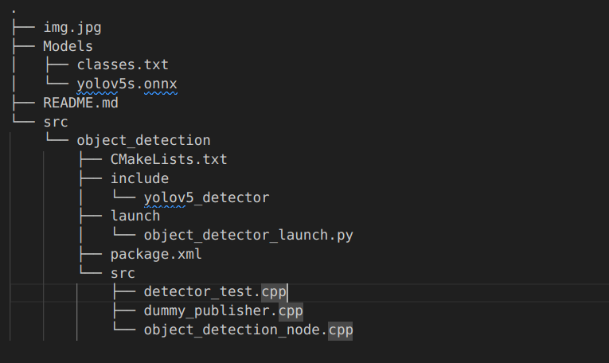
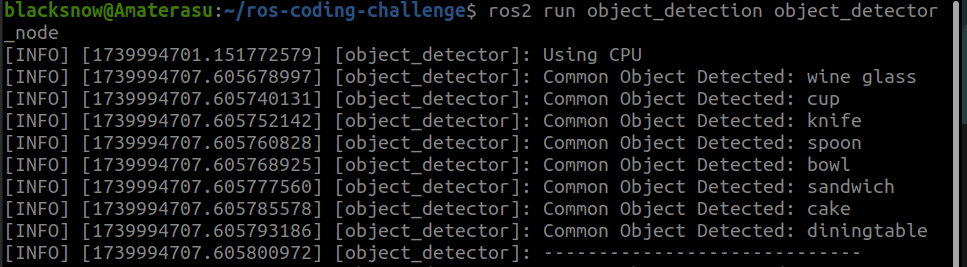

# ros-coding-challenge
Steps for the Robotics 88 coding challenge 🔥

1. Clone this repo locally and make a branch named `test/your-name`
2. Make a ROS2 package in C++ on this branch such that
    1. It subscribes to 2 synced image topics, e.g. `my_camera/image_left` and  `my_camera/image_right`
    2. In the image callback, it identifies at least one corresponding object in each pair of frames using machine learning
    3. It prints the classified type of the detected object
3. Add a launch file to make the image topic configurable
4. Create a PR here for your branch

-----

# Coding Challenge Solution

This ROS 2 package performs **object detection on synchronized image pairs** using a YOLOv5 ONNX model. The package includes:
- **detector_test.cpp** : A standalone script to test inference on a local image.
- **dummy_publisher.cpp** : Publishes two synchronized images at 5-second intervals for testing.
- **object_detection_node.cpp** : The main node that runs inference on image pairs and outputs detected matching classes.
- **object_detector_launch.py** : A launch file for configuring image topics dynamically.

## **Project Structure**


## Instructions for running the code

### For standalone mode and running inference on local image: (For testing and debugging)
```bash
ros2 run object_detection detector_test
```
### For actual solution:
1. Run this command in one terminal:
```bash
ros2 run object_detection image_publisher
```
2. Open another terminal and run this command:
```bash
ros2 run object_detection object_detector_node
```
3. The default topic names are `/my_camera/image_left` and `/my_camera/image_right` but can me modified with the launch file.
For the launch file, run this command:
```bash
ros2 launch object_detection object_detector_launch.py
```

### Output:

